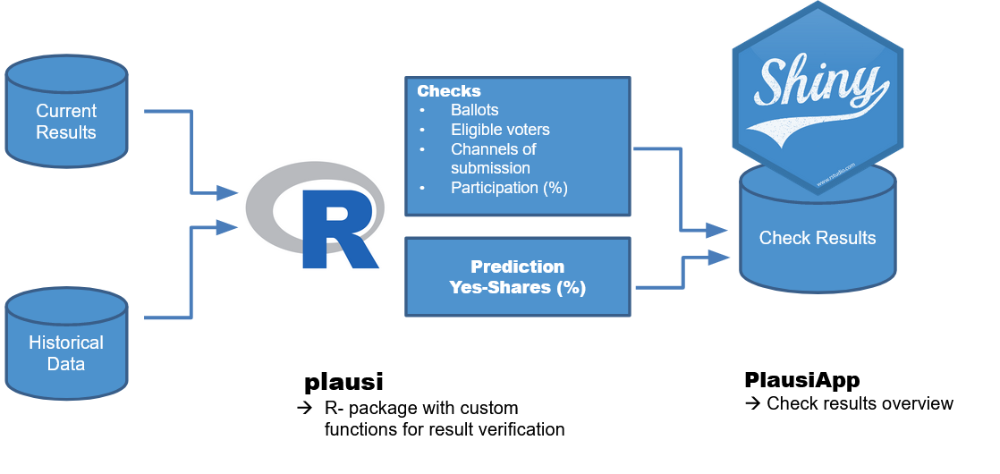

# The Statistical Office

[zh.ch/statistisches-amt]()

The Statistical Office provides the population, companies, politics, administration and organisations with __statistics, data and analyses on the Canton of Zurich__. 

Additionally it carries out a role related to poltical rights. It operates the __cantonal election and voting center__ during ballots. Municipalities count the incoming votes and submit their results to the Statistical Office, which asseses and verfies votes and election results and that submits the verified results for national votes / elections to the federal level.

---
# The Statistical Office

[zh.ch/statistisches-amt]()

.grey[The Statistical Office provides the population, companies, politics, administration and organisations with __statistics, data and analyses on the Canton of Zurich__. 

Additionally it carries out a role related to poltical rights. It operates the __cantonal election and voting center__ during ballots. Municipalities count the incoming votes and submit their results to the Statistical Office, which .Large[.black[__asseses and verfies vote and election results__]] and that submits the verified results for national votes / elections to the federal level.]

--

→ Since the beginning of 2020 we use the __Plausiapp__, a R-Shiny based Tool for this purpouse.


---
# Shiny at the Statistical Office : Use Cases


### Public Dashboards

.content-box-blue[User-Analytics Dashboard] : https://openzh.shinyapps.io/UAStat/

.content-box-blue[Customer Support Dashboard] : https://openzh.shinyapps.io/anfzh

.content-box-blue[AWEL]

### Internal Dashboards 

.content-box-red[PlausiApp]


---
# PlausiApp

The PlausiApp aims at systematically identifying anomalies in the results on vote sundays. It is a tool to assess and verify vote results.

### Aims

- Detect routine errors automatically at an early stage
- Reduce the workload caused by former ad hoc-verification
- Increase the quality of result submission and preventing the publication of erroneous results
- Build confidence in the electoral process

### Statistical plausibility / verification checks on voting Sunday

**Methods**

- Outlier detection
- Prediction of the plausible yes-share of municipalities given the main trend / patterns / voting via Machine Learning

---

# Architecture



---
background-image: url(https://randysrandom.com/wp-content/uploads/outlier.jpg)

# Outlier Detection

Do the reported values lie in the expected range?

__In relation to the past:__

- Channels of submission (mail / polling booths)

__In relation to other municipalities:__

- Ranking of the Participation (%) of <br>the various vote issues
- Share of ballots which are:
  - empty
  - invalid (with no clear vote intention)
  - contained in envelopes without transmission card
  

???
Participation : there's always a ranking - federal vote topics do usually have slightly higher participation than cantonal and certain topics do 'mobilize' slightly more. There usually is a very clear common pattern across municipalities.

- .... 

Median Absolute Deviation


---

# Prediction of Approval Patterns

Once a handful of municipalities have completed the count, a prediction of the final results (% of Yes Votes) for all areas can be made. 

```{r eval=FALSE}
library(plausi)

predict_votes(votes=c("Eidg1","Kant1"), 
              train=votedata, 
              exclude_votes=TRUE)
```
→ All the via [caret package](http://topepo.github.io/caret/index.html) available algorithms can be used.

**Comparison : prediction VS actual result**

Higher deviations between the actual and the predicted yes share may indicate errors.

---

# Prediction vs Result


---
background-image: url(https://randysrandom.com/wp-content/uploads/outlier.jpg)

What we're looking for... 

Direction .. 

Caveats : we spot only errors that <br> are statistically noticeable.

We might overlook errors that do not <br>
deviate from the expected patterns of a municpality.

However : claim : significant errors are also potentially more damaging... 
---
class: center, middle, inverse

background-image: url(https://images.unsplash.com/photo-1609669483452-46ce81e443eb?ixlib=rb-1.2.1&ixid=MnwxMjA3fDB8MHxwaG90by1wYWdlfHx8fGVufDB8fHx8&auto=format&fit=crop&w=2002&q=80)

# Outlook

---
# Outlook

- Stable version - minor improvements
- Share the Tool with other interested cantons
- .....


---
background-image: url(lib/Hintergrundbild2.jpg)
class: center, middle, inverse

# [Datenwerkstatt / R-Kurse](https://www.zh.ch/de/politik-staat/statistik-daten/datenwerkstatt.html)

# [Landingpage R-Austausch](https://github.com/statistikZH/rstats_ktzh/blob/master/README.md)


---
background-image: url(lib/Hintergrundbild2.jpg)
class: center, middle, inverse

<div class="contact">
<a href="https://twitter.com/statistik_zh" style="text-decoration: none; border-bottom:"><i class="fa fa-twitter fa-fw"></i>@statistik_zh</a><br> 
<a href="https://github.com/statistikZH"><i class="fa fa-github fa-fw"></i>Statistisches Amt Kanton Zürich</a><br> 
<a href="mailto:datashop@statistik.zh.ch"><i class="fa fa-paper-plane fa-fw"></i>datashop@statistik.zh.ch</a><br>


