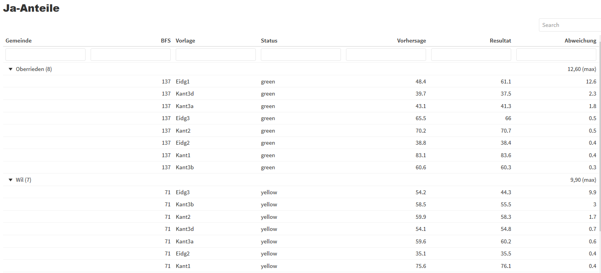

# The Statistical Office

[zh.ch/statistisches-amt]()

The Statistical Office provides the population, companies, politicians, the public administration and organisations with __statistics, data and analyses on the Canton of Zurich__. 

Additionally it carries out a role related to poltical rights. It operates the __cantonal election and voting center__ during ballots. Municipalities count the incoming votes and submit their results to the Statistical Office, which asseses and verfies votes and election results and that submits the verified results for national votes / elections to the federal level.

???
Unlike in many other cantons, where this is often a task of the state chancellery.

---
# The Statistical Office

[zh.ch/statistisches-amt]()

.grey[The Statistical Office provides the population, companies, politics, administration and organisations with __statistics, data and analyses on the Canton of Zurich__. 

Additionally it carries out a role related to political rights. It operates the __cantonal election and voting center__ during ballots. Municipalities count the incoming votes and submit their results to the Statistical Office, which .Large[.black[__asseses and verifies vote and election results__]] and that submits the verified results for national votes / elections to the federal level.]

--

→ Since the beginning of 2020 we use a R-Shiny based Tool, named __PlausiApp__, for this purpose.


---
# Shiny at the Statistical Office : Use Cases


### Public Dashboards

.content-box-blue[Web Analytics Dashboard] : https://openzh.shinyapps.io/UAStat/

.content-box-blue[Customer Support Analytics Dashboard] : https://openzh.shinyapps.io/anfzh

.content-box-blue[Local Climate Monitoring] : https://openzh.shinyapps.io/Lokalklima/

### Internal Dashboards 

.content-box-red[PlausiApp]

---
# PlausiApp

The PlausiApp aims at identifying anomalies in the results on vote sundays. It allows to assess and verify vote results systematically.

### Aims

- Detect routine errors automatically at an early stage
- Increase the quality of result submission and preventing the publication of erroneous results
- Reduce the workload caused by former ad hoc-verification
- Build confidence in the electoral process

### Statistical plausibility / verification checks on voting Sunday

**Methods**

- Univariate Outlier Detection
- Simulation of the expected yes-share for each municipality given the overall trends / consent patterns via Machine Learning

---

# Architecture


---
background-image: url(https://randysrandom.com/wp-content/uploads/outlier.jpg)

--

# Outlier Detection

Do the reported values lie in the expected range?

__In relation to the past:__

- Channels of submission (mail / polling booths)

__In relation to other municipalities:__

- Ranking of the Participation (%) of <br>the various vote issues
- Share of ballots which are:
  - empty
  - invalid (with no clear vote intention)
  - contained in envelopes without transmission card
  

???
Channels of submission - we check if the share of the votes submited by the differents channels (votes submitted by mail / votes submitted in person at the polling booth) lie within the expected range for each municipality given the past. The shares of the channels vary a bit according to the municipality type (bigger cities / smaller municipalities).

Participation : there's always a ranking - federal vote topics do usually have slightly higher participation than cantonal and certain topics do 'mobilize' slightly more. There usually is a very clear common pattern across municipalities.

We use the Median absolute deviation as a measure (robust / ideal for small sample size). We've tried out several measures (z-scores, tukeys fences) and even some multivariate approaches (isolation forests). But for our purposes the univariate MAD-approach works best when it comes to detect outliers, both when it comes to detection of errors as well as when it comes to interpretability (its easy to explain / interpret).
---

# Prediction of Approval Patterns

Once a handful of municipalities have completed the count, a prediction of the final results (% of Yes Votes) for all areas can be made. 

```{r eval=FALSE}
library(plausi)

predict_votes(votes=c("Eidg1","Kant1"), 
              train=votedata, 
              exclude_votes=TRUE)
```
→ All the via [caret package](http://topepo.github.io/caret/index.html) available algorithms can be used.

**Comparison : Prediction VS Actual Result**

→ Deviations between the actual and the predicted yes share may indicate errors.

---

# Prediction vs Result




???
Real life example with two municipalities with high deviations of the submitted results and the prediction. What we do in such cases : get in touch with the municipalities and ask them to check the reported numbers or even recount.

---
# Conclusion

> The PlausiApp has brought a significant gain in efficiency and allows to detect potentially damaging errors in a highly reliable way. 

- The higher the magnitude, the higher the potential distortion of the results and the higher the probability of detection

- Many checks are built in a way to signal even small deviations

- However, smaller errors that do not deviate from the expected patterns might sometimes still go undetected

---
class: center, middle, inverse

background-image: url(https://images.unsplash.com/photo-1609669483452-46ce81e443eb?ixlib=rb-1.2.1&ixid=MnwxMjA3fDB8MHxwaG90by1wYWdlfHx8fGVufDB8fHx8&auto=format&fit=crop&w=2002&q=80)

# Outlook

---
# Outlook

- __Ongoing minor improvements__

- __Making the PlausiApp accessible to other interested cantons__ 

   Cooperation with two Cantons to empower them to use the App ongoing

- __Common standard for result verification data exports__ 

  Coordinative efforts to define a common standard (ECH) for result verification data exports, in order that the tool could be used by any canton easily and irrespective of the result software in use.

- __Preparations for the elections 2023__

  Preparation of a verification logic suited for the elections 2023 (cantonal / national)

---
background-image: url(lib/Hintergrundbild2.jpg)
class: center, middle, inverse

# R in the Cantonal Administration

We have a vivid R-Community  and foster the usage of R in the cantonal administration &#128515;


# [Course: Data Science with R](https://www.zh.ch/de/politik-staat/statistik-daten/datenwerkstatt.html)


# [Landingpage R-Austausch](https://statistikzh.github.io/rstats_ktzh/)

---
background-image: url(lib/Hintergrundbild2.jpg)
class: center, middle, inverse

# Thanks for your attention!

.center[<div style="
font-size:120px;
margin: 90px;
">
&#128516;
</div>]
---
background-image: url(lib/Hintergrundbild2.jpg)
class: center, middle, inverse

<div class="contact">
<a href="https://twitter.com/statistik_zh" style="text-decoration: none; border-bottom:"><i class="fa fa-twitter fa-fw"></i>@statistik_zh</a><br> 
<a href="https://github.com/statistikZH"><i class="fa fa-github fa-fw"></i>Statistisches Amt Kanton Zürich</a><br> 
<a href="mailto:datashop@statistik.zh.ch"><i class="fa fa-paper-plane fa-fw"></i>datashop@statistik.zh.ch</a><br>


