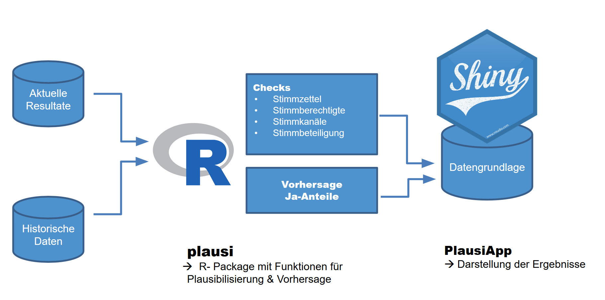
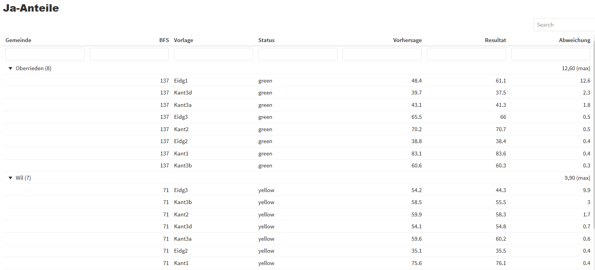

# PlausiApp

Die PlausiApp dient am Abstimmungssonntag der systematischen Identifikation von Anomalien in den Resultaten.

### Ziele

- Routinefehler frühzeitig erkennen
- Entlastung Plausi-Team
- Erhöhung der Qualität in der Resultatermittlung

### Statistikgestützte Plausibilisierung am Abstimmungssonntag

**Methodik**

- Ausreissererkennung
- Vorhersage / Simulation der Zustimmungsmuster via Machine Learning

---

# Architektur



---

# Vorhersage Ja-Anteile

Sobald eine handvoll Gebiete ausgezählt sind kann eine Vorhersage der Endresultate für alle Gebiete gemacht werden. 

```{r eval=FALSE}
library(plausi)

predict_votes(votes=c("Eidg1","Kant1"), 
              train=votedata, 
              exclude_votes=TRUE)
```
→ Alle via [caret package](http://topepo.github.io/caret/index.html) verfügbaren Modelle können verwendet werden.

**Vergleich Vorhersage VS tatsächliches Resultat**

Höhere Abweichungen zwischen dem tatsächlichen und dem prognostizierten Ja-Anteil können auf Fehler hinweisen. 

---

# Vorhersage Ja-Anteile




---
background-image: url(lib/Hintergrundbild2.jpg)
class: center, middle, inverse

# ML / AI

Bestehen Projekte oder Ideen für potentielle Anwendungfälle?

Besteht Interesse an Austausch / Weiterbildung in dem Bereich?

---
background-image: url(lib/Hintergrundbild2.jpg)
class: center, middle, inverse

# [Datenwerkstatt / R-Kurse](https://www.zh.ch/de/politik-staat/statistik-daten/datenwerkstatt.html)

# [Landingpage R-Austausch](https://github.com/statistikZH/rstats_ktzh/blob/master/README.md)

---
background-image: url(lib/Hintergrundbild2.jpg)
class: center, middle, inverse

<div class="contact">
<a href="https://twitter.com/statistik_zh" style="text-decoration: none; border-bottom:"><i class="fa fa-twitter fa-fw"></i>@statistik_zh</a><br> 
<a href="https://github.com/statistikZH"><i class="fa fa-github fa-fw"></i>Statistisches Amt Kanton Zürich</a><br> 
<a href="mailto:datashop@statistik.zh.ch"><i class="fa fa-paper-plane fa-fw"></i>datashop@statistik.zh.ch</a><br>


