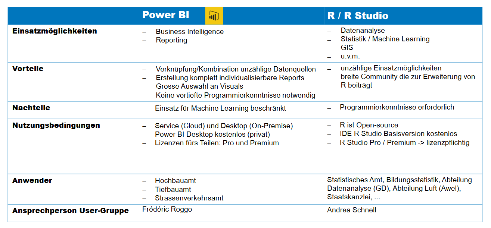

# Bei R stehen Daten im Fokus

R ist eine Programmiersprache und offene Software. 

Mir R kann man Daten ...

**... sammeln** , z.B. via Webscraping

**... transformieren** und flexibel in die gewünschte Form bringen

**... visualisieren** in Form von statischen oder interaktiven Grafiken 

**... modellieren** mit den unterschiedlichsten Methoden und Modellarten

**... präsentieren** in Dokumenten, Dashboards, Applikationen, oder auf einem Blog.

???

Wer hat bereits R genutzt? Leute bei euch die R nutzten?

Vom Sammeln der Daten (z.B. via Webscraping), Transformieren, über das Visualisieren (statisch / interaktiv) bis hin zur Erstellung von Webseiten (Blogs) oder Applikationen um die Daten zu präsentieren.

# Data Analysis in R

Data analysis with R is done in a series of steps. Programming, transforming, discovering, modeling and communicate the results.

__Program:__ R is a clear and accessible programming tool

__Transform:__ R is made up of a collection of libraries designed specifically for data science

__Discover:__ Investigate the data, refine your hypothesis and analyze them

__Model:__ R provides a wide array of tools to capture the right model for your data

__Communicate:__ Integrate codes, graphs, and outputs to a report with R Markdown or build Shiny apps to share with the world

---



???

- Programmiersprache und offene Software (seit 1993) / skriptsprache

A programming language & free software developed by Ross Ihaka and Robert Gentleman in 1993

- Possesses an extensive catalog of statistical and graphical methods 

- Entrusted by academia, but many large companies also use R programming language, including Uber, Google, Airbnb, Facebook and so on.

---
background-image: url(lib/Hintergrundbild2.jpg)
class: center, middle, inverse

# Demo : R-Studio als Entwicklungsumgebung

---

# R-Packages

R-Pakete bieten Zusatzfunktionen. Die am häufigsten verwendeten Pakete decken die verschiedenen Schritte des Arbeitsablaufs eines Datenwissenschaftler/in ab, von der Datensammlung bis zur Kommunikation der Ergebnisse.

**CRAN Repository**
https://cran.r-project.org/

```{r eval=FALSE}
install.packages("tidyverse")
```

Unsere eigenen R-Packages:

(extern / publik)
-  <a href="https://statistikzh.github.io/statR/index.html" style="color: #095484;text-decoration: none; border-bottom:"><i class="fa fa-github fa-fw"></i>statistikZH/statR</a> <br>

(intern)
- statools 
- zhMetadatenAPI

---
# Dashboards

### Öffentliche Dashboards

.content-box-blue[Web Analytics Dashboard] : https://openzh.shinyapps.io/UAStat/

.content-box-blue[Customer Support Analytics Dashboard] : https://openzh.shinyapps.io/anfzh

.content-box-blue[AWEL] : Link

### Interne Dashboards 

.content-box-red[PlausiApp] : https://tlorusso.github.io/talks/plausiapp_032021/#1


***
---
background-image: url(lib/Hintergrundbild2.jpg)
class: center, middle, inverse

# Community

Der R-Austausch richtet sich an R Nutzer*innen in der Zürcher Kantonsverwaltung. Er dient als Plattform für den Wissensaustausch und der Vernetzung rund um die offene Statistiksoftware R.

[Landing page](https://github.com/statistikZH/rstats_ktzh)

---
background-image: url(lib/Hintergrundbild2.jpg)
class: center, middle, inverse

# Training

Unser R-Kurs gibt Mitarbeiterinnen und Mitarbeitern der Verwaltung einen persönlichen Einstieg in Data Science mit R.

[Anmeldung](https://www.zh.ch/de/politik-staat/statistik-daten/datenwerkstatt/rstatszh-data-science-mit-r-anmelden.html)

---
background-image: url(https://cdn.dribbble.com/users/614757/screenshots/2216475/media/6ac75102940f3b8b2e6587f379d56ed3.gif)


